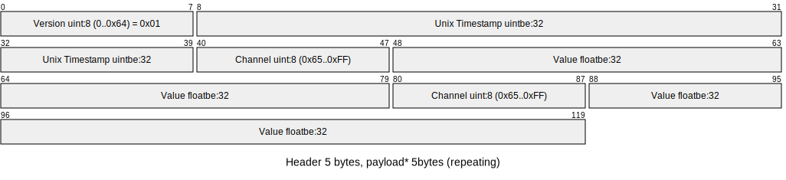
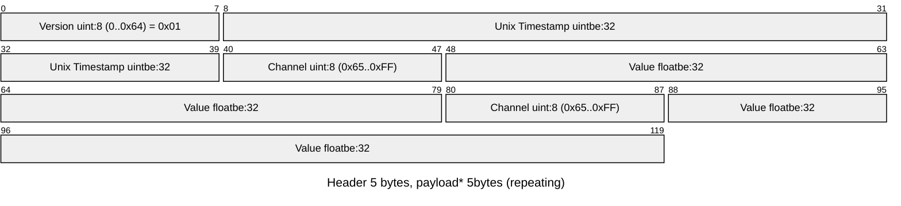

G2 MQTT Encoder
===

Build
--

Packaging system uses [uv](https://docs.astral.sh/uv/)

uv sync
uv build

Usage
---

```python
from g2_mqtt.g2_encoder import G2Encoder

encoder = G2Encoder()

measurements = [
    (1758536355, {'datatype': 'temperature', 'unit': 'C', 'value': 23.1, 'time': 0}),
    (1758536355, {'datatype': 'humidity', 'unit': '%', 'value': 45, 'time': 'ignored'}),
]

# Create a list of bytes-types packages
bytes_values = list(encoder.encode(measurements))

# Parse each package to measurement lists
measurements = []
for item in bytes_values:
    measurements += list(encoder.decode(item))

"""
Results to ->
measurements = [
    {'datatype': 'temperature', 'time': 1758536355, 'unit': 'C', 'value': 23.100000381469727},
    {'datatype': 'humidity', 'time': 1758536355, 'unit': '%', 'value': 45.0}
]
"""
```

Protocol
---

Message consists of a 5 byte header of (version, unix timestamp)
and repeating 5 byte payload of (channel, value)

Several messages of this form can be concatenated to one packet.

Data is sent to mqtt topic g2/{network}/{serial}/data





