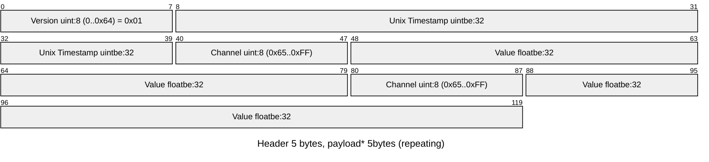

G2 MQTT Encoder
===

Channel list
---

| Datatype                    | Unit      | Channel | Description                          |
|-----------------------------|-----------|---------|--------------------------------------|
| version                     |           | 1       | < 0x65                               |
| timestamp                   | s         | 1       | Unix Timestamp (Seconds since EPOCH) |
| temperature                 | C         | 103     |                                      |
| humidity                    | %         | 104     |                                      |
| barometer                   | Pa        | 115     |                                      |
| pegasor:PN                  | n/cm^3    | 120     |                                      |
| pegasor:OmeFT               |           | 121     |                                      |
| pegasor:humidity            | %         | 122     |                                      |
| pegasor:FeedPressure        | kPa       | 123     |                                      |
| pegasor:ambient_temperature | C         | 124     |                                      |
| pegasor:board_temperature   | C         | 125     |                                      |
| pegasor:CMD                 | nm        | 126     |                                      |
| pegasor:error               |           | 127     |                                      |
| pegasor:PM                  | µg/m^3    | 128     |                                      |
| pegasor:LDSA                | µm^2/cm^3 | 129     |                                      |
| pegasor:PN_uncut            | n/cm^3    | 130     |                                      |
| lat                         | deg       | 136     |                                      |
| lon                         | deg       | 137     |                                      |
| activity                    |           | 200     |                                      |
| disk                        | %         | 201     |                                      |
| load                        |           | 202     |                                      |
| memory                      | %         | 203     |                                      |
| pump:i_term                 |           | 230     |                                      |
| pump:last_time              |           | 231     |                                      |
| pump:set_w                  | W         | 232     |                                      |
| pump:p_w                    | W         | 233     |                                      |
| pump:u_set_v                | V         | 234     |                                      |
| pump:u_v                    | V         | 235     |                                      |
| pump:i_a                    | A         | 236     |                                      |
| pump:freq                   | Hz        | 237     |                                      |
| pump:u_set_w                | W         | 238     |                                      |

Payload contents in binary data
---

Message consists of a 5 byte header of (version, unix timestamp)
and repeating 5 byte payload of (channel, value)

Several messages of this form can be concatenated to one packet.

Data is sent to mqtt topic g2/{network}/{serial}/data




Usage example
---

```python
from g2_mqtt.g2_encoder import G2Encoder

encoder = G2Encoder()

measurements = [
    (1758536355, {'datatype': 'temperature', 'unit': 'C', 'value': 23.1, 'time': 0}),
    (1758536355, {'datatype': 'humidity', 'unit': '%', 'value': 45, 'time': 'ignored'}),
]

# Create a list of bytes-types packages
bytes_values = list(encoder.encode(measurements))

# Parse each package to measurement lists
measurements = []
for item in bytes_values:
    measurements += list(encoder.decode(item))

"""
Results to ->
measurements = [
    {'datatype': 'temperature', 'time': 1758536355, 'unit': 'C', 'value': 23.100000381469727},
    {'datatype': 'humidity', 'time': 1758536355, 'unit': '%', 'value': 45.0}
]
"""
```

Build
--

Packaging system uses [uv](https://docs.astral.sh/uv/)

uv sync
uv build

